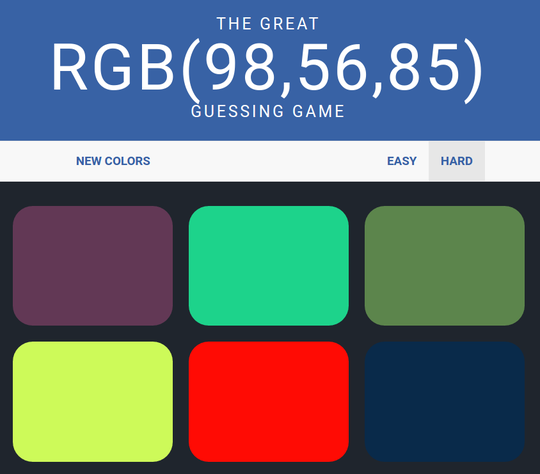

# Colour Game

## The App

Your goal is to correctly match the given RGB value to a coloured square. 

Clicking on a incorrect coloured square will tell you to 'Try Again' and the square disappears
fades away from the selection. 

Clicking on a correct coloured square, all squares reappear and 
changes to the correct colour as well as the title background colour. A message will congratulate 
you, 'Correct!'

You can press 'New Colors' to reset the game. There is an 'Easy' mode; with 3 squares, and 'Hard' 
mode; with six squares.

### Concepts used
* CSS styli
* DOM manipulation
* Event handling

#### Notes
* This was made to test my understanding of JS, CSS, HTML. This project idea was from a web development bootcamp.

